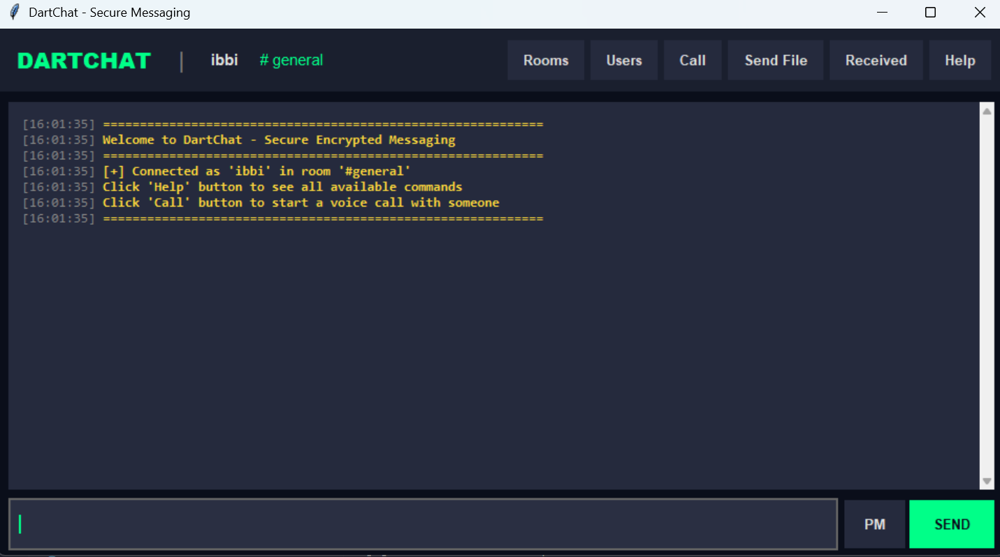
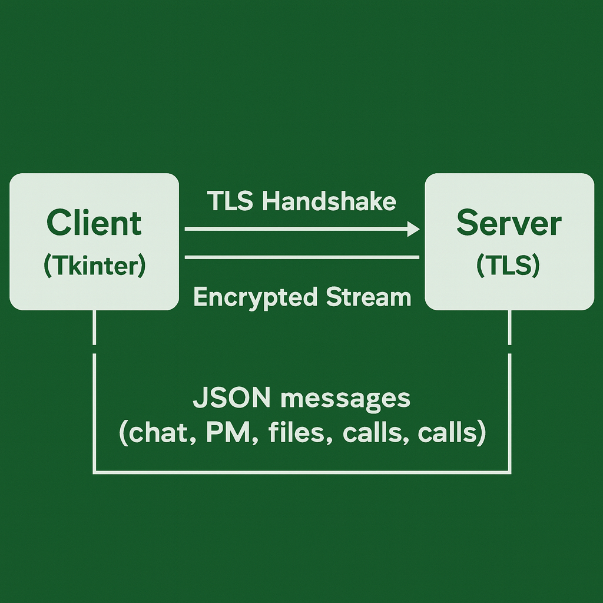
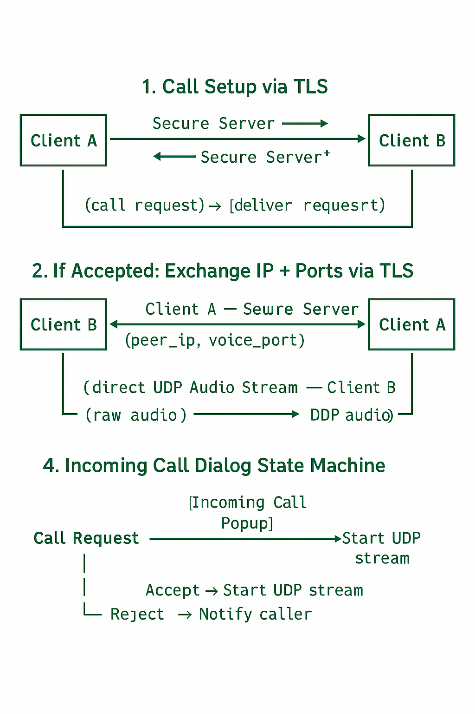
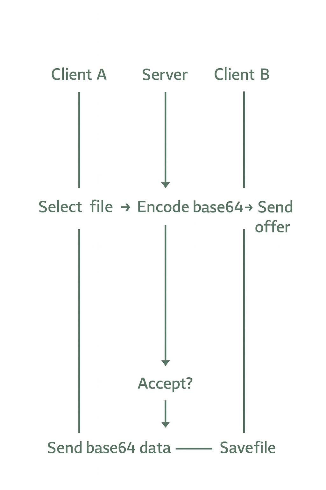

# 🟢 DartChat  
### Secure TLS-Encrypted Chat Client with Rooms, File Transfer & Real-Time Voice Calling  

---

## 📝 Overview  

**DartChat** is a fully encrypted, real-time chat system built with Python, featuring:

- TLS-secured communication  
- Multi-room chat architecture  
- Private messaging  
- File transfer (direct + broadcast)  
- Real-time P2P voice calling over UDP  
- Modern Tkinter GUI  

The project originally began as a **peer-to-peer design**, but following instructor feedback, evolved into a more robust, scalable **client–server model**, enhanced with TLS, room isolation, centralized routing, and server-side validation.

---

## ✨ Features

### 🔐 TLS Encryption
- Enforced TLS 1.2+  
- ECDHE forward secrecy  
- AES-GCM cipher suites  
- All signaling traffic (chat, private messages, file offers, call setup) encrypted  

### 🖥️ Tkinter GUI (Modern & Responsive)
- Styled with Dartmouth green palette  
- Chat window with autoscroll  
- File send dialogs  
- Incoming call popup  
- Downloads folder integration  

### 🏷️ Multi-Room System
- `general`, plus unlimited user-created rooms  
- Room membership tracked server-side  
- Room history stored per room  

### 💬 Private Messaging (PM)
- TLS-routed direct messages  
- Timestamped  
- Fully isolated from room chat  

### 📁 File Transfers
- Base64 encoding / decoding  
- Accept / reject workflow  
- Supports single-user and broadcast sending  
- Saved under `downloads/` automatically  
- Supports files up to **10MB**  

### 🔊 Real-Time Voice Calls
- Call signaling through TLS  
- Direct **UDP audio stream** after IP/port exchange  
- PyAudio-based microphone & speaker  
- Mute/unmute  
- Graceful call termination  
- Incoming call popup with Accept/Reject  

### 🛡 Server Safety & Stability
- Username validation (length, characters, uniqueness)  
- Room validity checks  
- Call cleanup if either user disconnects  
- Pending-file expiration  
- Thread-safe client registry  

---

## 🏗️ System Architecture

### 🔐 **High-Level TLS Architecture**

        ┌───────────┐       TLS Handshake       ┌───────────┐
        │  Client   │──────────────────────────►│  Server   │
        │ (Tkinter) │◄──────────────────────────│ (TLS)     │
        └─────┬─────┘       Encrypted Stream     └─────┬─────┘
              │                                        │
              │  JSON messages (chat, PM, files, calls)│
              └────────────────────────────────────────┘

---

### 📁 Project Structure

project/
│
├── server.py                 # TLS Server
├── client_gui.py             # Tkinter Client
├── certs/
│   ├── server.crt
│   └── server.key
└── downloads/                # auto-created, stores received files

---

### 🔧 Server Responsibilities
- TLS termination & certificate handling  
- Routing of:
  - Room messages  
  - Private messages  
  - File offers & transfers  
  - Call signaling (request/accept/reject/end)  
- Managing room membership & message history  
- Cleaning up dead clients & active calls  
- Preventing impersonation or invalid transitions  

### 💻 Client Responsibilities
- Graphical user interface  
- Rendering chat, room changes, PMs, file offers  
- Sending user actions (chat, PM, file send, call)  
- Running audio sender/receiver threads  
- Managing downloaded files  
- Modal dialogs for file + call interactions  

### 🔐 TLS Security

DartChat uses:
- `ssl.SSLContext(PROTOCOL_TLS_CLIENT/SERVER)`  
- Minimum TLS 1.2  
- AES-GCM + ECDHE cipher suites (forward secrecy)  
- Certificate-based encryption  
- Disabled hostname verification only for VM testing  
- Length-prefixed JSON protocol  

This ensures confidentiality, integrity, replay-attack prevention, and safe message framing.

---

## 📦 Installation & Setup

### 1️⃣ Clone Repository

- git clone <your-repo>
- cd dartchat 

### 2️⃣ Install Dependencies

We recommend using Conda:

- conda create -n voice python=3.8
- conda activate voice
- pip install pyaudio

Install other standard libraries as needed (ssl, tkinter, struct, etc. — already in Python).

### 3️⃣ Fix PyAudio on Linux VM (if needed)

PyAudio Fix:
If your VM needs it, set:

mkdir -p $CONDA_PREFIX/etc/conda/activate.d
echo 'export LD_LIBRARY_PATH=$CONDA_PREFIX/lib:$LD_LIBRARY_PATH' \
    > $CONDA_PREFIX/etc/conda/activate.d/env_vars.sh

### ▶️ Running the Project
Start server
python3 server.py

Start client
python3 chat_gui_client.py

### Connect using:

- Host: localhost
- Port: 9999
- Username: <any-valid-name>

### 📸 Screenshots

### 🧱 Challenges Solved

- Migrated from P2P → TLS server-based model

- Avoiding Tkinter UI freeze with threaded network I/O

- Stable JSON protocol with length-prefix headers

- Voice streaming in a constrained VM environment

- Cleaning up call state on drop/disconnect

- Coordinating file offers, acceptances, rejections

- Making PyAudio work inside conda/VM

### 🚀 Future Enhancements

- Group voice chat

- Encrypted PMs beyond TLS (E2EE)

- Message search / history persistence

- Drag-and-drop file sending

- Dockerized deployment

- Windows/macOS packaging